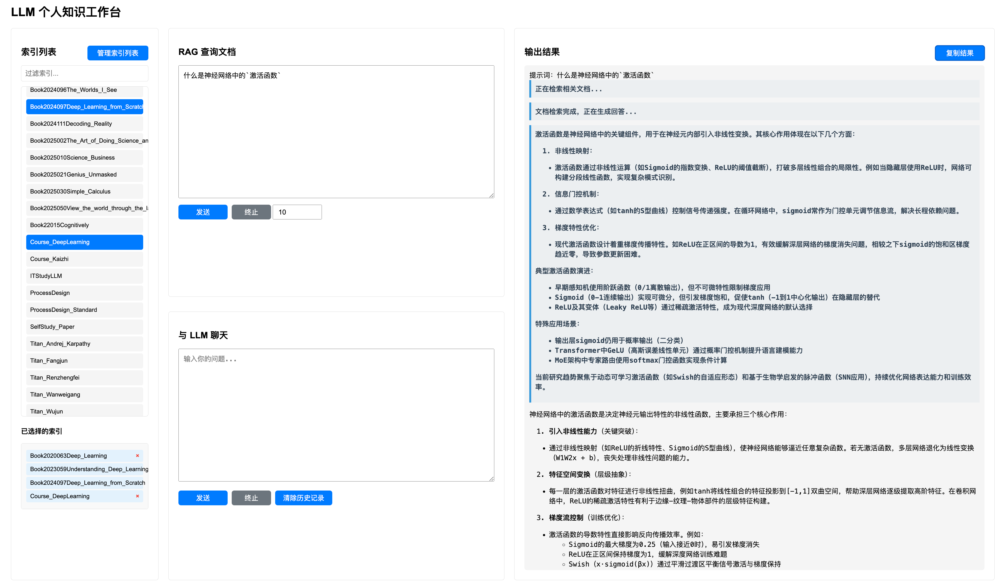
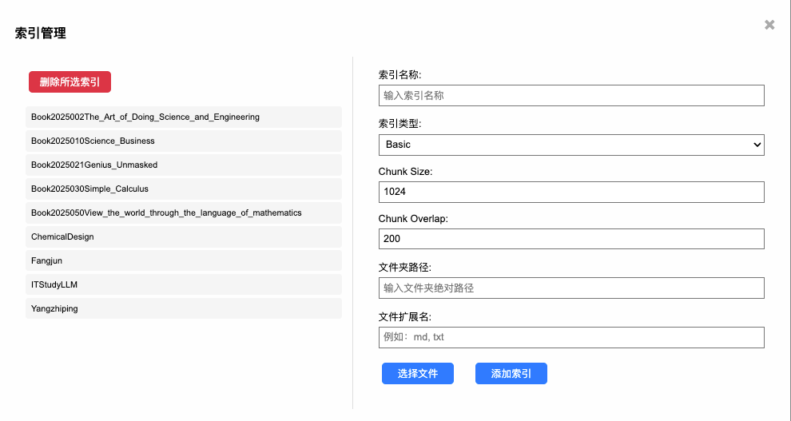

# Easy-RAG: High-Quality Retrieval-Augmented Generation System

[](https://github.com/yourusername/agent-rag/blob/main/LICENSE)
[](https://github.com/yourusername/agent-rag/stargazers)

## Table of Contents

- [Overview](#overview)
- [Requirements](#requirements)
- [Installation](#installation)
- [Usage](#usage)
- [Project Structure](#project-structure)
- [Citation](#citation)
- [Acknowledgement](#acknowledgement)

## Overview

easy-rag is a high-quality Retrieval-Augmented Generation (RAG) system designed for efficient and accurate document retrieval and question answering. The system leverages advanced techniques such as hierarchical node parsing, sentence window indexing, and auto-merging retrieval to provide precise and context-aware responses. With its modular architecture and flexible configuration, Agent-RAG is suitable for various applications, including academic research, enterprise knowledge management, and automated customer support.

Key Features:
- **Accurate Question Answering**: Utilizes advanced indexing and retrieval techniques for precise responses.
- **Flexible Indexing**: Supports multiple indexing strategies including basic fixed-size, auto-merging, and sentence window indexing.
- **Efficient Retrieval**: Implements hierarchical node parsing and sentence window retrieval for optimized performance.
- **Easy Deployment**: Provides a simple API interface for integration with existing systems.

<div align="center">
    
</div>

<div align="center">
    
</div>

## Requirements

- Python 3.10+
- Weaviate (for vector storage)

## Installation

1. Clone the repository:

git clone https://github.com/dalong0514/easy-rag.git

cd easy-rag

2. Install dependencies:

```
pip install -r requirements.txt
```

3. Set up Weaviate:

```
docker compose up -d
```

## Usage

### 1. API

Start the FastAPI server:

cd easy-rag

```
python -m api.main
```

### 2. Launching Web Interface

To start the web interface, follow these steps:

cd frontend

```
python main.py
```

Ensure the FastAPI server is running (see API section)

Open your web browser and navigate to:

```
http://localhost:8001
```

The web interface will provide:
   - Chat functionality
   - Index management
   - Real-time response streaming
   - Interactive query interface

## Project Structure

```
easy-rag/
├── api/                     # FastAPI application
│   └── main.py              # API endpoints
├── src/                     # Core functionality
│   ├── indexing.py          # Index building functions
│   ├── retrieval.py         # Document retrieval functions
│   └── utils.py             # Utility functions
├── eval/                    # Evaluation scripts
│   └── utils_eval.py        # Evaluation utilities
├── frontend/                # Frontend files
│   ├── static/              # Static assets
│   │   └── css/             # CSS files
│   │       └── styles.css   # CSS styles
│   └── templates/           # HTML templates
│       └── index.html       # Main HTML template
├── assets/                  # Static assets
│   └── overview.png         # Project overview image
├── requirements.txt         # Python dependencies
├── README.md                # Project documentation
├── LICENSE                  # MIT License file
├── .gitignore               # Git ignore file
└── docker-compose.yml       # Docker compose file for Weaviate
```

## Citation

If you use Agent-RAG in your research, please cite it as:

bibtex
@software{EasyRAG,
author = {Feng Dalong},
title = {Agent-RAG: High-Quality Agent-Based Retrieval-Augmented Generation System},
year = {2024},
publisher = {GitHub},
journal = {GitHub repository},
howpublished = {\url{https://github.com/dalong0514/easy-rag}}
}

## Acknowledgement

We would like to thank the open-source community for their contributions to the libraries and tools that made this project possible, including LlamaIndex, Weaviate, and FastAPI.

## Star History

